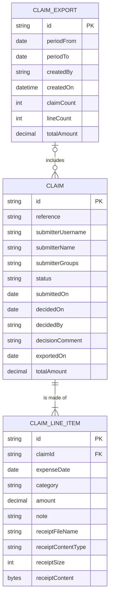

# Domain model

Three things are stored: an expense claim, the expense lines inside it, and the
payroll export that collects a period's approved lines. Who a person is comes
from sign-in, so there is no employee table and no record of who reports to
whom.

`CLAIM.status` is one of `draft`, `submitted`, `approved`, `rejected`,
`withdrawn`.

`CLAIM_LINE_ITEM.category` comes from the fixed list the product ships:
`travel`, `accommodation`, `meals`, `supplies`, `client-entertainment`,
`training`, `other`. Every line carries its own receipt — the bytes live on the
line, with the file's name and content type beside them.

`CLAIM.submitterGroups` holds the directory groups the submitter's sign-in token
carried when the claim was sent for approval, and that is what puts a claim in a
manager's queue: a manager sees the claims of employees who share one of the
manager's own groups. The product keeps no reporting line of its own.

`CLAIM.exportedOn` is stamped when an export includes the claim, which is what
keeps it out of the next export.