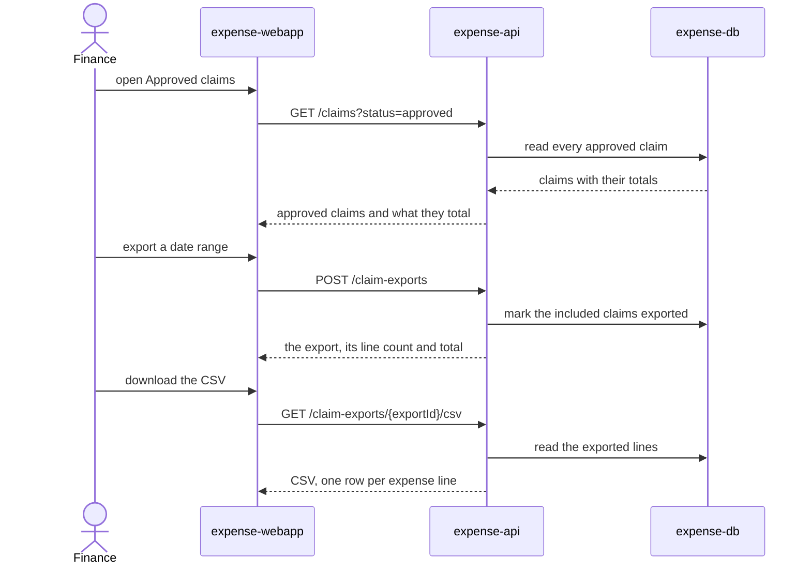

# Export approved claims to payroll

Finance sees every approved claim and what it totals, then exports a period's
worth as the file payroll imports.

```mermaid
sequenceDiagram
    actor Finance
    participant expense-webapp
    participant expense-api
    participant expense-db

    Finance->>expense-webapp: open Approved claims
    expense-webapp->>expense-api: GET /claims?status=approved
    expense-api->>expense-db: read every approved claim
    expense-db-->>expense-api: claims with their totals
    expense-api-->>expense-webapp: approved claims and what they total
    Finance->>expense-webapp: export a date range
    expense-webapp->>expense-api: POST /claim-exports
    expense-api->>expense-db: mark the included claims exported
    expense-api-->>expense-webapp: the export, its line count and total
    Finance->>expense-webapp: download the CSV
    expense-webapp->>expense-api: GET /claim-exports/{exportId}/csv
    expense-api->>expense-db: read the exported lines
    expense-api-->>expense-webapp: CSV, one row per expense line
```

