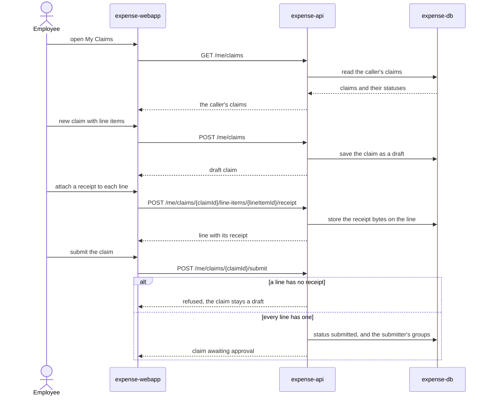

# File an expense claim

An employee records the expense lines of a trip, attaches a receipt to each, and
sends the claim to their manager for a decision.

```mermaid
sequenceDiagram
    actor Employee
    participant expense-webapp
    participant expense-api
    participant expense-db

    Employee->>expense-webapp: open My Claims
    expense-webapp->>expense-api: GET /me/claims
    expense-api->>expense-db: read the caller's claims
    expense-db-->>expense-api: claims and their statuses
    expense-api-->>expense-webapp: the caller's claims
    Employee->>expense-webapp: new claim with line items
    expense-webapp->>expense-api: POST /me/claims
    expense-api->>expense-db: save the claim as a draft
    expense-api-->>expense-webapp: draft claim
    Employee->>expense-webapp: attach a receipt to each line
    expense-webapp->>expense-api: POST /me/claims/{claimId}/line-items/{lineItemId}/receipt
    expense-api->>expense-db: store the receipt bytes on the line
    expense-api-->>expense-webapp: line with its receipt
    Employee->>expense-webapp: submit the claim
    expense-webapp->>expense-api: POST /me/claims/{claimId}/submit
    alt a line has no receipt
        expense-api-->>expense-webapp: refused, the claim stays a draft
    else every line has one
        expense-api->>expense-db: status submitted, and the submitter's groups
        expense-api-->>expense-webapp: claim awaiting approval
    end
```

