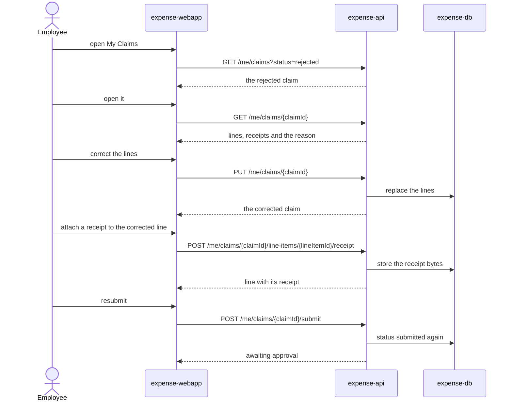

# Resubmit a rejected claim

An employee reads why their claim was turned down, corrects it, and sends it
back for another decision.

```mermaid
sequenceDiagram
    actor Employee
    participant expense-webapp
    participant expense-api
    participant expense-db

    Employee->>expense-webapp: open My Claims
    expense-webapp->>expense-api: GET /me/claims?status=rejected
    expense-api-->>expense-webapp: the rejected claim
    Employee->>expense-webapp: open it
    expense-webapp->>expense-api: GET /me/claims/{claimId}
    expense-api-->>expense-webapp: lines, receipts and the reason
    Employee->>expense-webapp: correct the lines
    expense-webapp->>expense-api: PUT /me/claims/{claimId}
    expense-api->>expense-db: replace the lines
    expense-api-->>expense-webapp: the corrected claim
    Employee->>expense-webapp: attach a receipt to the corrected line
    expense-webapp->>expense-api: POST /me/claims/{claimId}/line-items/{lineItemId}/receipt
    expense-api->>expense-db: store the receipt bytes
    expense-api-->>expense-webapp: line with its receipt
    Employee->>expense-webapp: resubmit
    expense-webapp->>expense-api: POST /me/claims/{claimId}/submit
    expense-api->>expense-db: status submitted again
    expense-api-->>expense-webapp: awaiting approval
```

