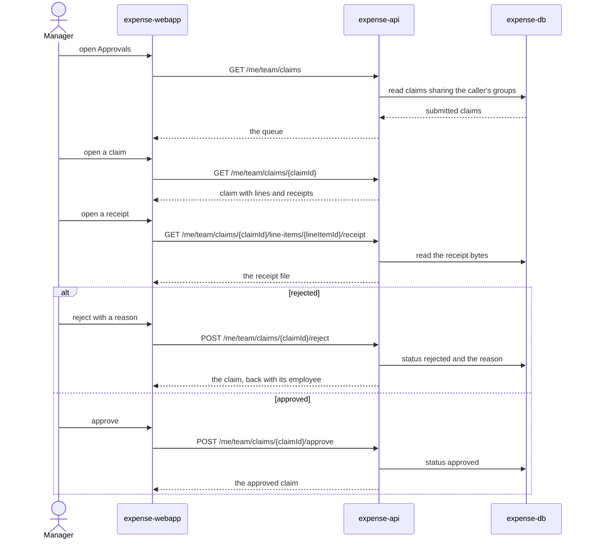

# Review a submitted claim

A manager opens the claims their team has submitted, inspects the lines and
receipts, and approves or rejects each one.

```mermaid
sequenceDiagram
    actor Manager
    participant expense-webapp
    participant expense-api
    participant expense-db

    Manager->>expense-webapp: open Approvals
    expense-webapp->>expense-api: GET /me/team/claims
    expense-api->>expense-db: read claims sharing the caller's groups
    expense-db-->>expense-api: submitted claims
    expense-api-->>expense-webapp: the queue
    Manager->>expense-webapp: open a claim
    expense-webapp->>expense-api: GET /me/team/claims/{claimId}
    expense-api-->>expense-webapp: claim with lines and receipts
    Manager->>expense-webapp: open a receipt
    expense-webapp->>expense-api: GET /me/team/claims/{claimId}/line-items/{lineItemId}/receipt
    expense-api->>expense-db: read the receipt bytes
    expense-api-->>expense-webapp: the receipt file
    alt rejected
        Manager->>expense-webapp: reject with a reason
        expense-webapp->>expense-api: POST /me/team/claims/{claimId}/reject
        expense-api->>expense-db: status rejected and the reason
        expense-api-->>expense-webapp: the claim, back with its employee
    else approved
        Manager->>expense-webapp: approve
        expense-webapp->>expense-api: POST /me/team/claims/{claimId}/approve
        expense-api->>expense-db: status approved
        expense-api-->>expense-webapp: the approved claim
    end
```

